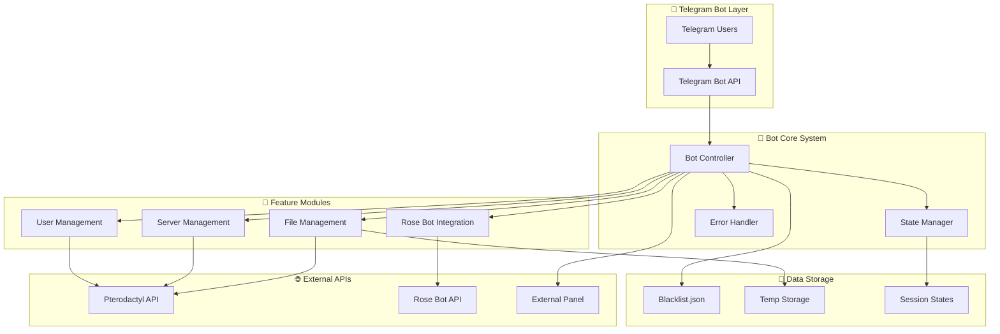
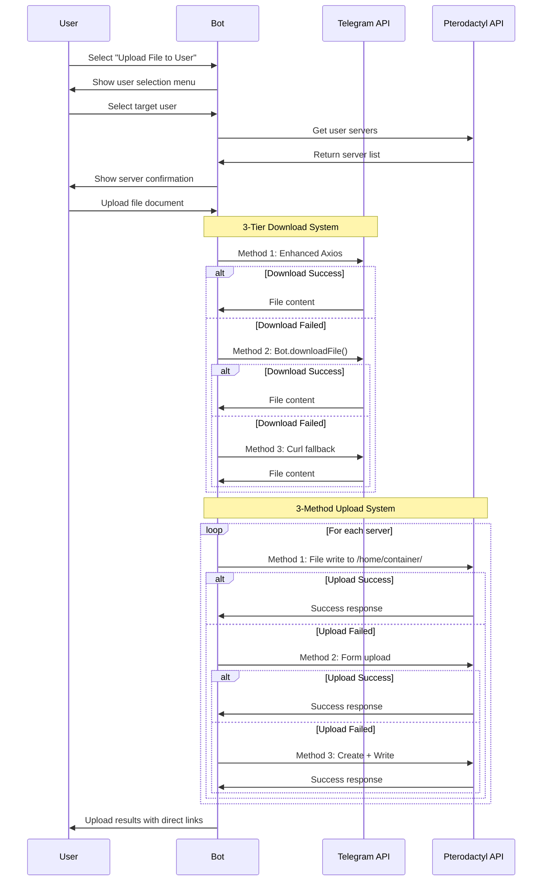
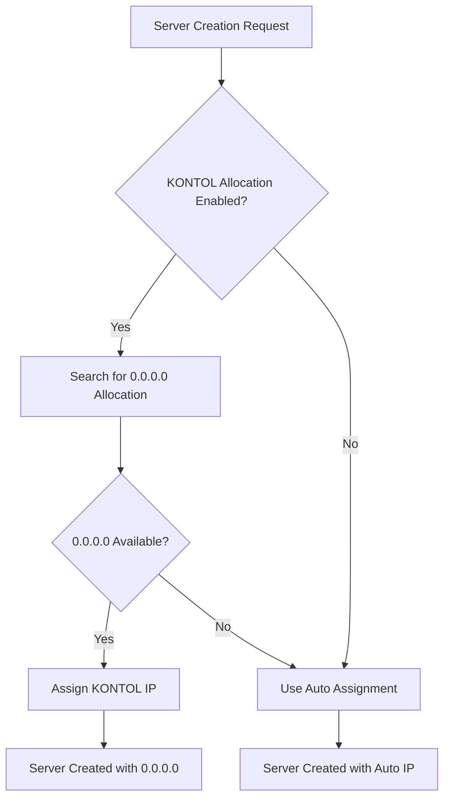

# 🚀 TelegramME - Advanced Pterodactyl Management Bot

<div align="center">


**🎯 Enterprise-grade Telegram Bot untuk mengelola Pterodactyl Panel dengan fitur canggih**

[📖 Documentation](#-documentation) • [🚀 Quick Start](#-quick-start) • [⚡ Features](#-features) • [🔧 Configuration](#-configuration)

</div>

---

## 📋 Table of Contents

- [🎯 Overview](#-overview)
- [⚡ Features](#-features)
- [🏗️ Architecture](#️-architecture)
- [🚀 Quick Start](#-quick-start)
- [🔧 Configuration](#-configuration)
- [📊 Feature Documentation](#-feature-documentation)
- [🛠️ API Reference](#️-api-reference)
- [🔒 Security](#-security)
- [🐛 Troubleshooting](#-troubleshooting)
- [🤝 Contributing](#-contributing)

---

## 🎯 Overview

TelegramME adalah bot Telegram canggih yang dirancang khusus untuk mengelola Pterodactyl Panel dengan fitur enterprise-grade. Bot ini menyediakan interface yang user-friendly untuk administrasi server, manajemen user, upload file, dan integrasi dengan berbagai sistem eksternal.

### 🌟 Key Highlights

- **🔥 KONTOL IP Allocation System** - Sistem alokasi IP khusus dengan 0.0.0.0
- **📁 Advanced File Management** - Upload file ke root directory dengan multiple fallback methods
- **🌹 Rose Bot Integration** - Integrasi lengkap dengan Rose Bot untuk federation management
- **🛡️ Enterprise Security** - Error handling, input validation, dan security hardening
- **⚡ High Performance** - Network optimization, connection pooling, dan retry mechanisms

## ⚡ Features

### 🎯 Core Panel Management
- **🖥️ Server Control**: Restart, reinstall, start/stop servers
- **👥 User Management**: Create, delete, change password, manage permissions
- **📊 Statistics**: Real-time server stats, user analytics, resource monitoring
- **🔧 Admin Tools**: Comprehensive admin panel dengan advanced controls

### 📁 Advanced File Management
- **📤 Upload to Root Directory**: Upload file langsung ke `/home/container/`
- **📋 Setor Creds**: Upload JSON credentials ke folder `/session`
- **🔄 Multiple Upload Methods**: 3-tier fallback system untuk reliability
- **🛡️ Security**: File validation, size limits, path sanitization

### 🎯 KONTOL IP Allocation System
- **🌐 Custom IP Allocation**: Sistem khusus untuk IP 0.0.0.0
- **🔄 Auto Fallback**: Fallback ke auto-assignment jika tidak tersedia
- **⚙️ Configurable**: Dapat dikonfigurasi untuk IP allocation lainnya

### 🌹 Rose Bot Integration
- **🚫 FBAN System**: Federation ban management
- **👥 Federation Management**: Join/leave federations, view info
- **🔍 User Status Checking**: Check FBAN status dan membership
- **🎨 Telegram ID Cards**: Beautiful ASCII card display

### 🛡️ Enterprise Security & Stability
- **🔒 Input Validation**: Comprehensive validation untuk semua input
- **🛡️ Error Handling**: Enterprise-grade error handling dengan retry logic
- **📊 Network Optimization**: DNS configuration, connection pooling, IPv4 forcing
- **🔄 Fallback Systems**: Multiple fallback methods untuk setiap operasi

### 🚀 Quick Start

#### 📋 Prerequisites
- **OS**: Ubuntu/Debian VPS dengan root access
- **Runtime**: Node.js 18+ dan npm
- **Panel**: Pterodactyl Panel installation
- **Bot**: Telegram Bot Token dari @BotFather
- **API**: Pterodactyl Application API Key

#### 🔧 Installation

1. **Clone Repository**
```bash
git clone https://github.com/el-pablos/TelegramME.git
cd TelegramME
```

2. **Install Dependencies**
```bash
npm install
```

3. **Install Additional Packages**
```bash
npm install form-data
```

4. **Configure Environment**
```bash
cp .env.example .env
nano .env
```

5. **Start Bot**
```bash
node bot.js
```

## 🏗️ Architecture

### 📊 System Architecture Diagram



### 🔄 File Upload Flow Diagram



## 🔧 Configuration

### 📝 Environment Variables

Buat file `.env` dengan konfigurasi berikut:

```env
# 🤖 Telegram Bot Configuration
BOT_TOKEN=your_telegram_bot_token_here
OWNER_ID=your_telegram_user_id_here

# 🌐 Pterodactyl Panel Configuration
PANEL_URL=https://your-panel-domain.com
APP_API_KEY=your_application_api_key_here
CLIENT_API_KEY=your_client_api_key_here

# 🎯 KONTOL IP Allocation (Optional)
KONTOL_IP=0.0.0.0
FORCE_KONTOL_ALLOCATION=true

# 🌹 Rose Bot Integration (Optional)
ROSE_API_URL=https://api.rose.bot
ROSE_API_KEY=your_rose_api_key_here

# 🔗 External Panel Integration (Optional)
EXTERNAL_PANEL_URL=https://external-panel.com
EXTERNAL_API_KEY=your_external_api_key_here
```

### ⚙️ Advanced Configuration

#### 🌐 Network Configuration
```javascript
// DNS Servers (Google DNS + Cloudflare)
dns.setServers(['8.8.8.8', '8.8.4.4', '1.1.1.1', '1.0.0.1']);

// HTTP Agent Configuration
const httpsAgent = new https.Agent({
    keepAlive: true,
    keepAliveMsecs: 30000,
    maxSockets: 50,
    maxFreeSockets: 10,
    timeout: 30000,
    family: 4 // Force IPv4
});
```

#### 📁 File Upload Limits
```javascript
// File size limit (20MB)
const maxFileSize = 20 * 1024 * 1024;

// Allowed file extensions
const allowedExtensions = [
    '.json', '.txt', '.js', '.py', '.sh',
    '.yml', '.yaml', '.env', '.conf', '.cfg'
];
```

## 📊 Feature Documentation

### 🎯 KONTOL IP Allocation System

Sistem alokasi IP khusus yang memungkinkan server menggunakan IP 0.0.0.0:



**Features:**
- ✅ Automatic detection of 0.0.0.0 allocation
- ✅ Fallback to auto-assignment if unavailable
- ✅ Configurable IP address (not limited to 0.0.0.0)
- ✅ Detailed logging and error handling

### 📁 File Management System

#### 📤 Upload File to Root Directory

Upload file langsung ke `/home/container/` dengan akses via panel:

```
📁 File Structure:
/home/container/
├── your-uploaded-file.js     ← File Anda di sini
├── session/                  ← Setor creds masuk ke sini
│   ├── creds.json
│   └── session.json
└── other-files...
```

**Upload Process:**
1. **User Selection**: Pilih user target dari daftar
2. **Server Detection**: Bot otomatis detect semua server user
3. **File Upload**: Upload file ke root directory semua server
4. **Direct Links**: Dapatkan link langsung ke file editor

**Access URLs:**
```
https://your-panel.com/server/{uuid}/files/edit#/filename.js
```

#### 📋 Setor Creds vs Upload File

| Feature | Setor Creds | Upload File |
|---------|-------------|-------------|
| **Target Directory** | `/home/container/session/` | `/home/container/` |
| **File Types** | JSON only | Multiple types |
| **Purpose** | Credentials storage | General file upload |
| **Access** | Session folder | Root directory |

### 🛡️ Security Features

#### 🔒 Input Validation & Sanitization

```javascript
// File extension validation
const allowedExtensions = ['.json', '.txt', '.js', '.py', '.sh'];
const isValidFile = allowedExtensions.includes(path.extname(filename));

// File size validation
const maxSize = 20 * 1024 * 1024; // 20MB
const isValidSize = fileSize <= maxSize;

// Filename sanitization
const safeFilename = filename.replace(/[^a-zA-Z0-9-_.]/g, '_');
```

#### 🛡️ Network Security

```javascript
// Force IPv4 to prevent IPv6 issues
const agent = new https.Agent({ family: 4 });

// DNS configuration with trusted servers
dns.setServers(['8.8.8.8', '8.8.4.4', '1.1.1.1']);

// Request timeout and retry logic
const config = {
    timeout: 30000,
    maxRedirects: 5,
    retry: 3
};
```

#### 🔐 API Security

- **🔑 Token Masking**: Sensitive tokens di-mask dalam logs
- **🛡️ Input Validation**: Semua input user divalidasi
- **🚫 Path Traversal Protection**: Filename sanitization
- **⏱️ Rate Limiting**: Delay antar request untuk prevent spam
- **🔄 Error Recovery**: Graceful error handling tanpa expose sensitive data

## 🛠️ API Reference

### 📡 Pterodactyl API Integration

#### Application API Endpoints
```javascript
// User Management
GET    /api/application/users              // List all users
GET    /api/application/users/{id}         // Get user details
POST   /api/application/users              // Create user
PATCH  /api/application/users/{id}         // Update user
DELETE /api/application/users/{id}         // Delete user

// Server Management
GET    /api/application/servers            // List all servers
GET    /api/application/servers/{id}       // Get server details
POST   /api/application/servers            // Create server
PATCH  /api/application/servers/{id}       // Update server
DELETE /api/application/servers/{id}       // Delete server
```

#### Client API Endpoints
```javascript
// Server Control
POST /api/client/servers/{uuid}/power      // Power actions
POST /api/client/servers/{uuid}/command    // Send command

// File Management
GET    /api/client/servers/{uuid}/files/list          // List files
POST   /api/client/servers/{uuid}/files/write         // Write file
POST   /api/client/servers/{uuid}/files/create        // Create file
POST   /api/client/servers/{uuid}/files/upload        // Upload file
DELETE /api/client/servers/{uuid}/files/delete        // Delete file
```

### 🌹 Rose Bot API Integration

```javascript
// Federation Management
GET  /api/v1/federation/{fed_id}           // Get federation info
POST /api/v1/federation/{fed_id}/fban      // Add FBAN
POST /api/v1/federation/{fed_id}/unfban    // Remove FBAN

// User Status
GET /api/v1/user/{user_id}/status          // Check user status
GET /api/v1/user/{user_id}/fbans           // Get user FBANs
```

## 🐛 Troubleshooting

### 🚨 Common Issues & Solutions

#### 1. **File Upload Fails**

**Problem**: `ETIMEDOUT` atau `ENETUNREACH` errors

**Solution**:
```bash
# Check DNS configuration
nslookup api.telegram.org

# Test network connectivity
curl -I https://api.telegram.org

# Restart bot with verbose logging
DEBUG=* node bot.js
```

#### 2. **Pterodactyl API Errors**

**Problem**: `401 Unauthorized` atau `403 Forbidden`

**Solution**:
```bash
# Verify API keys
curl -H "Authorization: Bearer YOUR_API_KEY" \
     https://your-panel.com/api/application/users

# Check API key permissions in panel admin
```

#### 3. **Bot Not Responding**

**Problem**: Bot tidak merespon commands

**Solution**:
```bash
# Check bot process
ps aux | grep node

# Check logs
tail -f bot.log

# Restart bot
pkill -f bot.js
node bot.js
```

#### 4. **Memory Issues**

**Problem**: Bot menggunakan memory berlebihan

**Solution**:
```bash
# Monitor memory usage
htop

# Restart bot dengan memory limit
node --max-old-space-size=512 bot.js

# Clear temp files
rm -rf temp/*
```

### 📊 Performance Monitoring

#### System Requirements
- **RAM**: Minimum 512MB, Recommended 1GB+
- **CPU**: 1 vCPU minimum
- **Storage**: 1GB free space
- **Network**: Stable internet connection

#### Monitoring Commands
```bash
# Check bot status
systemctl status telegram-bot

# Monitor resource usage
htop -p $(pgrep -f bot.js)

# Check network connectivity
ping -c 4 api.telegram.org

# View recent logs
journalctl -u telegram-bot -f
```

## 🤝 Contributing

### 🛠️ Development Setup

1. **Fork Repository**
```bash
git clone https://github.com/your-username/TelegramME.git
cd TelegramME
```

2. **Install Development Dependencies**
```bash
npm install --dev
```

3. **Create Feature Branch**
```bash
git checkout -b feature/your-feature-name
```

4. **Make Changes & Test**
```bash
# Test your changes
npm test

# Run linting
npm run lint

# Start development server
npm run dev
```

5. **Submit Pull Request**
```bash
git add .
git commit -m "feat: add your feature description"
git push origin feature/your-feature-name
```

### 📝 Code Style Guidelines

- **ES6+**: Use modern JavaScript features
- **Async/Await**: Prefer async/await over promises
- **Error Handling**: Always implement proper error handling
- **Comments**: Document complex logic
- **Security**: Validate all inputs and sanitize outputs

### 🏷️ Issue Labels

When contributing, please use appropriate labels:

- `🐛 bug` - Bug reports
- `✨ enhancement` - New features
- `📚 documentation` - Documentation improvements
- `🔧 maintenance` - Code maintenance
- `🚀 performance` - Performance improvements
- `🛡️ security` - Security-related changes

---

## 📄 License

This project is licensed under the MIT License - see the [LICENSE](LICENSE) file for details.

## 🙏 Acknowledgments

- **Pterodactyl Panel** - Amazing game server management panel
- **Rose Bot** - Telegram group management bot
- **Node.js Community** - For excellent libraries and tools
- **Contributors** - Everyone who helped improve this project

## 📞 Support

### 🆘 Need Help?

- **📖 Documentation**: Check this README first
- **🐛 Bug Reports**: [Create an issue](https://github.com/el-pablos/TelegramME/issues)
- **💡 Feature Requests**: [Create an issue](https://github.com/el-pablos/TelegramME/issues)
- **💬 Discussions**: [GitHub Discussions](https://github.com/el-pablos/TelegramME/discussions)

### 📊 Project Stats


---

<div align="center">

**🚀 Made with ❤️ by [el-pablos](https://github.com/el-pablos)**

**⭐ If this project helped you, please give it a star!**

[🔝 Back to Top](#-telegramme---advanced-pterodactyl-management-bot)

</div>


